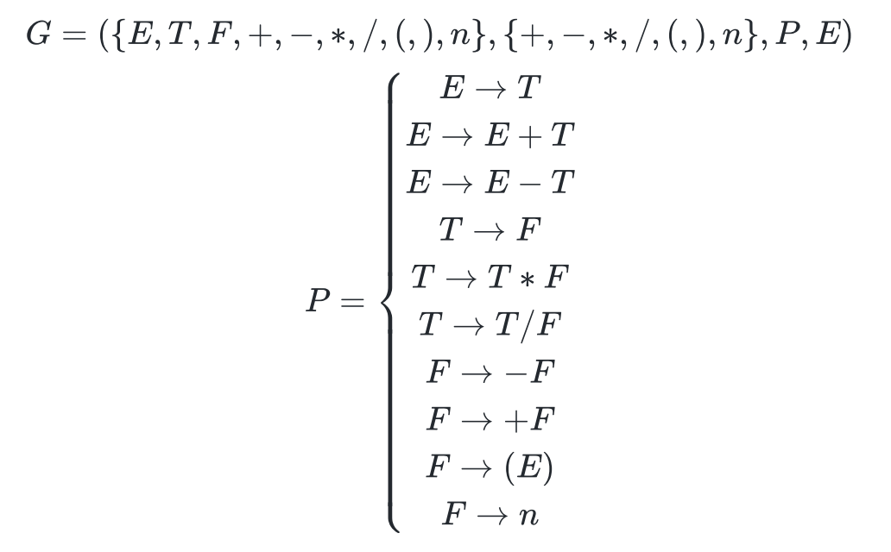

# projetoCompiladorLogComp

## Diagrama Sintático do roteiro 1:

## Diagrama Sintático do roteiro 2:

## Diagrama Sintático do roteiro 3:

## Diagrama Sintático do roteiro 5:

### EBNF:

- EXPRESSION = TERM, { ("+" | "-"), TERM } ;

- TERM = FACTOR, { ("*" | "/"), FACTOR } ;

- FACTOR = ("+" | "-") FACTOR | "(" EXPRESSION ")" | number ;

- BLOCK = {STATEMENT}

- STATEMENT = ("\n" | IDENTIFICADOR, "=" , EXPRESSION, "\n" | print, "(", EXPRESSION, ")", "\n")

- IDENTIFICADOR = (letter| "_") {letter | number | "_"}

